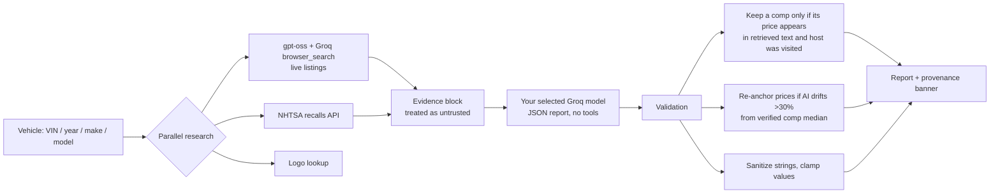

# APEX

### A number, and the receipts.

**AI vehicle analyzer for people who buy, sell, and flip cars.**
Scan a VIN. Get a valuation grounded in listings it actually found, today, with the links to prove it.

[**Launch APEX →**](https://johnlaz.github.io/apex/app/) · Installable PWA · No account · No backend · Your key never leaves your device

---

## Why APEX

Most "AI car value" tools hand you a confident number from a model that has never seen a listing. APEX is built the other way around: **evidence first, AI second.**

Every report carries a banner that tells you exactly how much to trust it:

| Banner | Meaning |
|---|---|
| **LIVE-SOURCED** | At least 2 comparable listings were found, and each price was verified against the retrieved page text. |
| **PARTIAL** | Research ran, but fewer than 2 comps survived verification. Treat the range as softer. |
| **ESTIMATE ONLY** | Live research failed (rate limit, no results). The number is the AI's general knowledge, labeled as such. |
| **LEGACY SNAPSHOT** | A report saved by an older version. Shown with its age, never presented as current. |

Reports 3+ days old get an age warning. Dates come from your device clock, not from when the app was written.

## Features

- **Live-sourced comps + Evidence tab.** Real asking prices with links to the listings they came from.
- **Provenance banner.** Always shows the basis, the as-of date, and source chips.
- **NHTSA recalls.** Pulled from the official NHTSA API (model-level).
- **VIN barcode scan and decode.**
- **Photo ID.** Snap a car and identify it with a vision model.
- **Garage.** Track ROI, maintenance, and export CSV.
- **Compare.** Side-by-side vehicles.
- **Print-ready reports.**
- **Dealer Forms.** Curated form reference by state.
- **5 themes.**
- **Offline PWA.** Installs to your home screen; the shell works offline.
- **Auto-updating Groq models.** Paste your key and APEX pulls the newest chat models available to you, with a picker in Settings. If Groq retires your model, APEX re-pulls the list and retries automatically.
- **Local-only key.** Stored in your browser's localStorage and sent only to Groq.

## How it works

## What's real, what's AI, what you'll never see

| Real (retrieved or computed) | AI knowledge (labeled) | Never shown |
|---|---|---|
| Comparable listings and prices that passed verification | General vehicle context, narrative, ownership notes | Fabricated KBB / Edmunds / Manheim / NADA values |
| NHTSA recall records | Estimate-only price ranges (flagged ESTIMATE ONLY) | Invented days-on-market or inventory counts |
| Dealer margin (computed from retail minus trade-in) | Photo identification | Made-up regional saturation stats |
| Report date and age (device clock) | Dealer form link suggestions (flagged unverified) | Anything stamped with the year the app was built |

When APEX can't measure something, it says **"No data"** instead of guessing.

## Quick start

1. Open **https://johnlaz.github.io/apex/app/** and install it to your home screen if you like.
2. Get a free API key at [console.groq.com](https://console.groq.com).
3. Open Settings, paste the key, and save. APEX loads your available models automatically.
4. Enter a VIN or year/make/model and run the analysis.

## Good to know

- **Rate limits.** Live research uses Groq's browser search on gpt-oss models. If your tier's limits are hit, APEX falls back to ESTIMATE ONLY and says so.
- **Listings are asking prices**, not sold prices. Use them as market signal, not appraisal.
- **Recalls are model-level**, not VIN-specific. Confirm a VIN at nhtsa.gov/recalls.
- **Privacy.** No accounts, no analytics, no server. Data lives in your browser. Backups you export include your API key, so keep them private.
- **Not financial advice.** APEX is a research aid. Inspect the car, verify the title, check the listings yourself.

## Tech

Single-file HTML PWA. Vanilla JS, no framework, no build step, no backend. Service worker for offline use. Groq API (bring your own key) and the NHTSA public API.

## What's new in v2.6

- Retired Groq models replaced; model list now auto-refreshes with a user picker.
- Evidence-first valuation: verified comps, provenance banner, Evidence tab.
- Removed the fabricated KBB/Edmunds/MMR/NADA source table and invented market stats.
- Real NHTSA recall data.
- All dates driven by your device clock; no hardcoded year.
- Sanitized AI output; form links restricted to https on the same host or .gov.

## Ideas, not promises

- Optional licensed data feed for sold-price and days-on-market stats
- VIN-level recall lookup
- Saved-search price alerts
- Price history per Garage vehicle

---

**Built by LAZLAB Creations**

